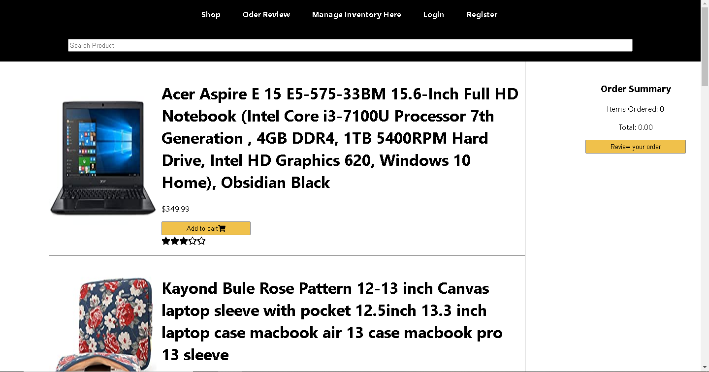
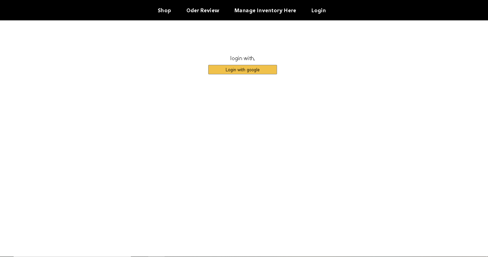
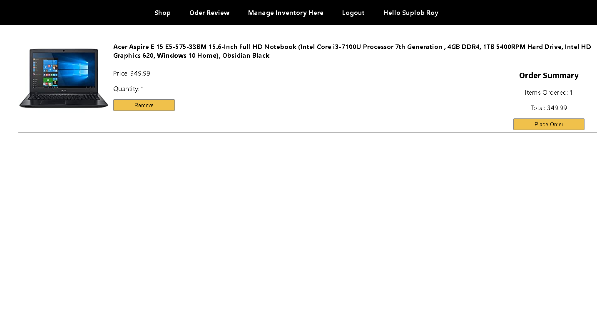
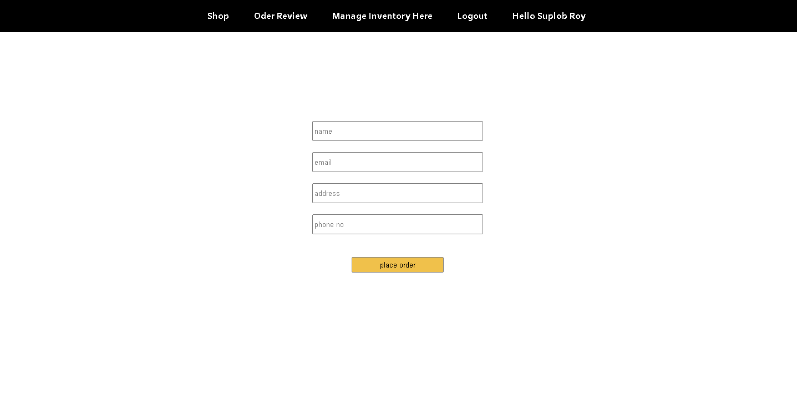

# Ema John Clone Website

Link to [Live Site](https://ema-john-29ae8.web.app/)

Link to the [Backend Code](https://github.com/Suplob/ema-john-backend)

This is a complete full stacked not amazon clone site made with ReactJS and MongoDB.

## Technologies used to make this website

- ReactJS
- React Routing
- ExpressJS
- NodeJS
- MongoDB
